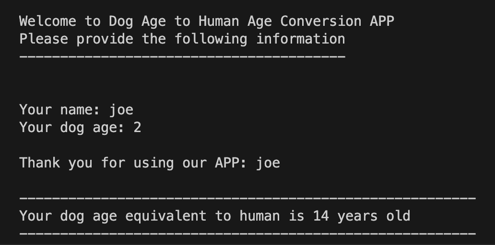

# HW.0 Dog to Human age conversion 

You are asked by your fellow friend to develop an application that allows any dog owner to convert their dog age to human age.

This will provide more sympathy and attention to the dog.

 

### Task: Your task is to create an application to record the following information from your user.

 

### Instruction:
> - Ask for user inputs
>> Input:
>> - User's name
>> - Dog's age
> - Do a calculation by multiplying the dog age by 7 (ex: dog's age * 7)
> - Then display result in a creative way.
> - lastly print output
>> Output:

### Expected Output:

  

<h1 style="text-align: center;">*** Be Creative ***</h1>