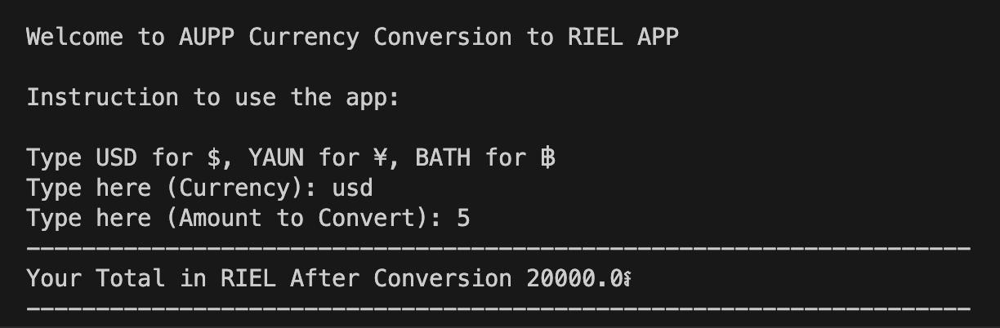

# HW. 1 Currency Conversion

You are working as a software developer at a currency exchange company call AUPP Currency EX.
Your manager assigned you to create an application that can handle transactions below:

- Exchange from USD to RIEL, USD rate=4000៛.
- Exchange from YUAN to RIEL, YUAN rate=643៛.
- Exchange from BATH to RIEL, BATH rate=123៛.

 

## Technical requirement (condition):

The application development team required you to create a function call currency_conversion that take 2 parameters, **(Currency and Amount)**.

Make sure that currency_conversion function return the following value in different situation:

1. When invalid currency provided, make sure the function return **‘Not Found’**
2. If the amount is not number type, make sure the function return **‘Invalid Amount’**
3. If both parameters are correct, return convert value from the function example:
   > - currency_conversion('USD', 2) # function should return 8000

 

### Task: Your task is to create an application that help user to currency of their choice to Reil.

 

### Instruction:

> - In the main file ask for user inputs
>   > Input:
>   >
>   > - Ask user to pick the desire currency (with option display)
>   > - Ask user to pick the desire amount to convert
> - Do a calculation according to user input by multiplying the input with the desire currency (ex: currency \* amount)
> - Then display result in a creative way.

### Expected Output:

### HINT:

> - Create 2 files:
>   1. One that contain function for currency [backend]
>   2. The other to ask for user input and calling back function for calculation [frontend]
> - Call the function to the main file.

  

<h1 style="text-align: center;">*** Be Creative ***</h1>
